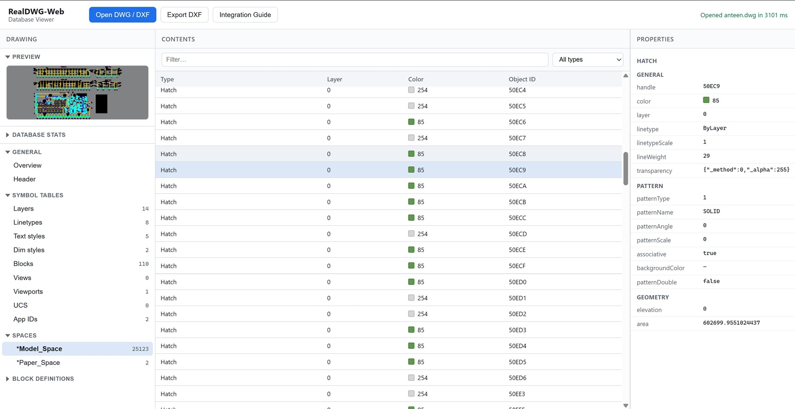

# RealDWG-Web Example

Customer-facing demo for [@mlightcad/data-model](https://www.npmjs.com/package/@mlightcad/data-model) (npmjs) and the private DWG converter [`@mlightcad/dwg-converter`](https://github.com/mlightcad/dwg-converter) (GitHub Packages).

It is both:

1. An **integration sample** — how to authenticate, install, deploy worker assets, register `AcDbDwgConverter`, and call `AcDbDatabase.read()`
2. A **DWG/DXF database viewer** — browse preview, stats, symbol tables, block entities, and entity properties after parse

This is **not** a canvas CAD viewer. For WebGL viewing see [`cad-simple-viewer-example`](https://github.com/mlightcad/cad-simple-viewer-example).

**Live demo:** https://mlightcad.github.io/realdwg-web-example/



## Features

- Open local `.dwg` / `.dxf` files in the browser
- DWG via private `@mlightcad/dwg-converter` (web worker)
- DXF via built-in MIT `AcDbNativeDxfConverter`
- Left pane: thumbnail preview + database stats + navigation tree
- Center: symbol table records or entity list (filter / type)
- Right: property inspector (`entity.properties`)
- Export the opened database as DXF

## Prerequisites

- Node.js ≥ 20
- pnpm ≥ 10
- Membership in the [mlight-cad](https://github.com/mlight-cad) GitHub organization (required to pull `@mlightcad/dwg-converter`)
- A GitHub token with `read:packages` for that account

## Getting started

`@mlightcad/dwg-converter` is a **private** package on GitHub Packages. Before `npm install` / `pnpm install` can succeed, you must:

1. Email [mlight.lee@outlook.com](mailto:mlight.lee@outlook.com) to request access and join the **mlight-cad** GitHub organization. Include your **GitHub username**. Details and the email template are in [`PROPRIETARY-PARSER.md` → “Trial License”](https://github.com/mlightcad/cad-viewer/blob/main/PROPRIETARY-PARSER.md#trial-license).
2. Accept the organization invitation in GitHub.
3. Create a personal access token with `read:packages` and set it as `GITHUB_TOKEN`.

Without organization membership and a valid token, installing `@mlightcad/dwg-converter` will fail.

`.npmrc` is already configured so that:

- Public `@mlightcad/*` packages (e.g. `data-model`) install from **npmjs**
- Private `@mlightcad/dwg-converter` is fetched from **GitHub Packages** (lockfile tarball URL + `GITHUB_TOKEN`)

To add the private converter in a new project (do **not** remap the whole `@mlightcad` scope to GitHub Packages — that breaks public packages on npmjs):

```bash
pnpm add @mlightcad/dwg-converter --registry https://npm.pkg.github.com
```

```bash
# PowerShell
$env:GITHUB_TOKEN = "ghp_..."

# bash
export GITHUB_TOKEN=ghp_...

pnpm install
pnpm dev
```

Open the printed URL, then **Open DWG / DXF**.

## License key

Optional. Copy `.env.example` to `.env`:

```bash
VITE_DWG_LICENSE_KEY=your-signed-key
```

Omit the key to use the converter’s **30-day evaluation** trial.

If you need a formal **trial license request** (e.g. longer evaluation or production pilots), see the DWG proprietary parser docs: [`PROPRIETARY-PARSER.md` → “Trial License”](https://github.com/mlightcad/cad-viewer/blob/main/PROPRIETARY-PARSER.md#trial-license).

## Worker assets

Vite copies these into `assets/` at build/dev time:

- `dwg-parser-worker.js`
- `dwg-codepage-*.bin`

Registration in code:

```ts
import { AcDbDatabaseConverterManager, AcDbFileType } from '@mlightcad/data-model'
import { AcDbDwgConverter } from '@mlightcad/dwg-converter'

const converter = new AcDbDwgConverter({
  parserWorkerUrl: './assets/dwg-parser-worker.js',
  licenseKey: import.meta.env.VITE_DWG_LICENSE_KEY
})
AcDbDatabaseConverterManager.instance.register(AcDbFileType.DWG, converter)
```

See the in-app **Integration Guide** button (opens `guide.html` in a new tab) for the full read pipeline.

## Scripts

| Command | Description |
|---------|-------------|
| `pnpm dev` | Vite dev server |
| `pnpm build` | Typecheck + production build |
| `pnpm preview` | Serve `dist/` |

## Troubleshooting

| Symptom | Likely cause |
|---------|----------------|
| 401/403 installing `@mlightcad/dwg-converter` | Not a member of **mlight-cad**, or missing/invalid `GITHUB_TOKEN` |
| Worker failed to load / 404 | `dwg-parser-worker.js` not copied to `assets/` |
| License / trial error | Trial expired or invalid `VITE_DWG_LICENSE_KEY` |

## License

MIT for this example app. `@mlightcad/dwg-converter` remains private / UNLICENSED and is distributed separately.
